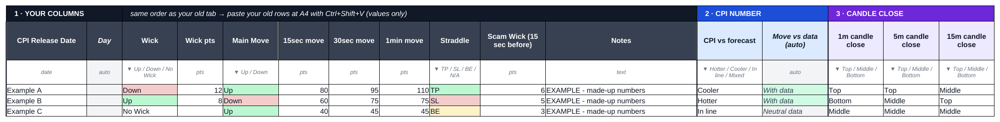
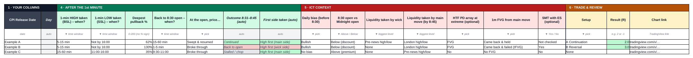

# CPI $NQ backtest template (Google Sheets)

A ready-made backtest log for CPI releases on NQ: one row per release, dropdowns, automatic labels,
a Stats tab that fills itself, and a Guide tab with definitions and an ICT replay checklist.

**Continuing the work?** Start with [HANDOFF.md](HANDOFF.md) (status, open questions, how-to) and
[backtest/RULES.md](backtest/RULES.md) (exact definition of every column).

**Download:** [`CPI_NQ_Backtest_Template.xlsx`](CPI_NQ_Backtest_Template.xlsx?raw=1)




## Put it in your existing Google Sheet

1. Open your CPI sheet → **File → Import → Upload** → pick `CPI_NQ_Backtest_Template.xlsx`.
2. Import location: **Insert new sheet(s)** → **Import data**. Three tabs appear: `CPI Log`, `Stats`, `Guide`.
3. Move your old rows over: in your old tab select **A2:K82** → copy → in `CPI Log` click **A4** →
   **Ctrl+Shift+V** (Mac: Cmd+Shift+V = paste values only, keeps the dropdowns and colours).
   Columns A–K are in the same order as your old tab, so one paste does it. Keep the old tab as a backup.
4. Fill the new columns while replaying each release (TradingView chart set to New York time).

## Tabs

| Tab | What it is |
| --- | --- |
| `CPI Log` | One row per CPI. White = you fill, grey = automatic. Hover a header to see its definition. |
| `Stats` | Updates automatically: outcome after the 1st minute (by hotter/cooler CPI), when price returns to the 8:30 open, how long until the 1-min high/low (BSL/SSL) is taken, candle-close location, pullback depth (50% / OTE), straddle results, ICT conditions, and win rate / avg R per setup. Change the two dates at the top to test a period. |
| `Guide` | Quick start, every definition, the column guide with a complete example row, setups to test, and the replay routine. |

## Columns

| Section | Columns |
| --- | --- |
| 1 · Your columns (A–K) | CPI Release Date, Day, Wick, Wick pts, Main Move, 15sec / 30sec / 1min move, Straddle, Scam Wick (15 sec before), Notes |
| 2 · CPI number | CPI vs forecast · Move vs data *(auto)* |
| 3 · Candle close | 1m / 5m / 15m candle closed in the Top / Middle / Bottom third |
| 4 · After the 1st minute | 1-min HIGH taken (BSL) – when? · 1-min LOW taken (SSL) – when? · Deepest pullback % · Back to 8:30 open – when? · At the open, price… · Outcome 8:31–8:45 *(auto)* · First side taken *(auto)* |
| 5 · ICT context | Daily bias · 8:30 open vs Midnight open · Liquidity taken by wick · Liquidity taken by main move · HTF PD array at extreme *(optional)* · 1m FVG from main move · SMT with ES *(optional)* |
| 6 · Trade & review | Setup · Result (R) · Chart link |

## Rebuilding / checking the file

```bash
pip install -r requirements.txt
python tools/build_template.py            # writes CPI_NQ_Backtest_Template.xlsx
python tools/verify_template.py           # needs LibreOffice: recalculates test data and checks every formula
python tools/render_previews.py           # needs LibreOffice + pdftoppm: writes screenshots/
```

Formulas only use functions that work the same in Google Sheets, Excel and LibreOffice.

## Backtesting a release (`backtest/`)

| Script | What it does |
| --- | --- |
| `fxreplay_fetch.py` | Logs in to FX Replay and downloads the NQ/ES bars for one release date (credentials from env vars). |
| `rules.py` | Computes every new CPI Log column from those bars, following [RULES.md](backtest/RULES.md). |
| `sheet.py` | `snapshot` / `fill` / `check` the Google Sheet (sheet id from `CPI_SHEET_ID`). |
| `test_rules.py` | Reproduces the two verified rows (12 Aug and 11 Sep 2026) plus unit tests. |
