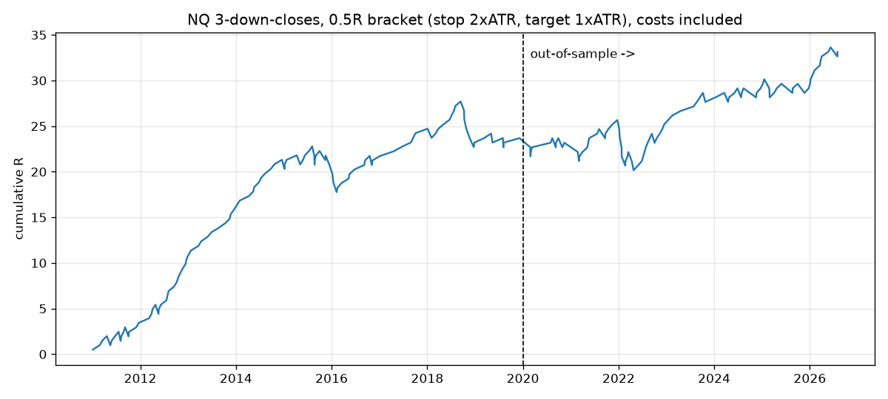

# NQ / GC: a 0.5R strategy with a 90% win-rate target. Research and backtests

**The request:** a fixed-bracket strategy on NQ or GC futures with reward:risk = 0.5 (the
target is half the stop distance) and a 90% win rate.

**Short answer:** I could not find one that holds up, and I don't think one exists that can be
trusted. Nearly 5,000 rule variants and a walk-forward machine-learning model were tested on
16 years of 1-minute data. None of them won 90% at a true 0.5R, at a usable trade frequency,
in both the period used to choose the rules and the later test period.

- Only one rule had both at least 30 in-sample trades and a 90%+ in-sample win rate (NQ, 31
  trades). It won 74% on new data.
- The closest result overall is a slow, buy-and-hold-style gold trade: an 8-ATR stop (median
  about 11% below entry) and roughly 4 trades a year. It won 90.6% of 32 trades in 2020-2026,
  but only 84% in 2009-2019. It rides gold's bull market rather than predicting anything.

The best strategy that passed validation wins about **74% out of sample** (break-even at
0.5R is 66.7%). It keeps a modest edge, about +0.1R per trade. It is described below with
every number reproducible from this repo.

> Not financial advice. Backtests use proxy data (see *Limitations*). Trade small or on sim
> first.

## The strategy: NQ "3 down closes" mean reversion (0.5R bracket)

All times are US/Eastern. A "session" is the CME Globex day, 18:00 -> 17:00.

1. **Signal.** At the 17:00 close, check whether NQ has closed *lower than the previous
   session's close* for **3 or more sessions in a row**.
2. **Entry.** If so, **buy at market at 18:05** when Globex reopens.
3. **Bracket (OCO), placed from the fill price:**
   - stop = entry - **2.0 x ATR(14)** (Wilder ATR of daily Globex bars, as of the signal close)
   - target = entry + **1.0 x ATR(14)**, so reward:risk = **0.5**
4. **No management.** No time exit, no trailing, no scaling. One position at a time. Ignore
   new signals while a trade is open. Roll the position if it is still open at the quarterly
   contract roll.

The rules were chosen using 2010-11 to 2019-12 data only. Among 9 pre-registered candidates,
this one had the highest lower confidence bound on its in-sample win rate. Everything after
that period is out of sample.

### Results (costs included: $5 round trip, 1 tick slippage on entry and stop, target fills only on a 1-tick trade-through)

| sample | trades | per yr | win rate | 95% CI | exp. R/trade | profit factor | max DD |
|---|---|---|---|---|---|---|---|
| In-sample 2010-11 .. 2019-12 (used to choose the rules) | 114 | 12.8 | 80.7% | 72.5-86.9% | +0.208R | 2.07 | 5.0R |
| **Out-of-sample 2020-01 .. 2026-09** | **91** | 14.2 | **73.6%** | 63.7-81.6% | **+0.104R** | 1.39 | 5.5R |
| Extra out-of-sample: Nasdaq-100 index daily bars 2000 .. 2010 (incl. dot-com crash and 2008) | 149 | 13.9 | 69.8% | 62.0-76.6% | +0.039R | 1.13 | 8.2R |
| Same rule on **gold (GC)** 2020-2026 (not tuned for gold) | 77 | 11.9 | 67.5% | 56.5-76.9% | +0.012R | 1.04 | 9.1R |

What this means:

- Expect a win rate **in the low 70s**, not 90%. The profit comes from winning more often than
  the 66.7% break-even. That edge is modest. On the 91 out-of-sample trades alone it is **not
  statistically significant** (p = 0.10 against break-even). The full 2010-2026 sample is
  (p < 0.001), but that sample includes the data used to choose the rules.
- The edge is specific to the Nasdaq. On gold the same rule is roughly break-even, and no gold
  rule survived selection either.
- Costs barely matter because the stops are wide: 2 daily ATRs, about 850 NQ points at
  September 2026 prices. The median hold is about 3 days; the 90th percentile is 10 days.
- Nearby settings give similar results, so the 74% is not tied to one exact parameter set.
  3+ down closes with a 1.5-2.5 ATR stop gives 71.4-73.7% out of sample, and a 18:30 entry
  gives 74.2%. Waiting for the 09:30 open is worse (70.1%). See
  [`reports/strategy_results.md`](reports/strategy_results.md).



### If 90% is the real requirement

Win rate and reward:risk trade off against each other. With the same entries and stop, a
smaller target gives a higher win rate:

| target / stop (RR) | break-even WR | in-sample WR | out-of-sample WR | OOS exp. R/trade |
|---|---|---|---|---|
| 0.10 | 90.9% | 93.3% | 95.0% | +0.045 |
| **0.20** | 83.3% | 90.4% | **88.0%** | +0.055 |
| 0.25 | 80.0% | 89.6% | 85.6% | +0.069 |
| **0.50** | 66.7% | 80.7% | **73.6%** | +0.104 |
| 1.00 | 50.0% | 65.7% | 56.2% | +0.124 |

A 90% win rate is roughly what an RR of 0.2 gives, with a thinner edge per trade than 0.5R.

## Why 90% at 0.5R is not realistic

- **The math.** If price moves randomly, it hits a target of +0.5 before a stop of -1 exactly
  2/3 of the time. The baseline test agrees: entering at random times gives 61-71% depending
  on direction and drift ([`reports/research/01_baseline.txt`](reports/research/01_baseline.txt)).
  A 90% strategy would earn **+0.35R per trade** (0.9 x 0.5 - 0.1 x 1). That is far more than
  anything documented in liquid index or gold futures.
- **The search.** Results are in [`reports/research/`](reports/research/) and summarised in
  [`reports/REPORT.md`](reports/REPORT.md).
  - Daily and intraday rule families: the best in-sample win rate was 81.0% (at least 100
    trades). The top 10 fell from 77.8% in-sample to 71.5% out of sample.
  - Very wide stops that ride the long-run uptrend: holds of 1-2 months gave about 82-88%
    overall, on 50-90 trades in 16 years. This family includes the gold result above.
  - Setups often advertised as ~90% do much worse on a strict 0.5R bracket, with zero or
    negative expectancy. The 15-minute opening-range breakout wins 60-62%. Gap fills win at
    most 67% (small gaps) and much less for bigger gaps.
  - A gradient-boosting model trained walk-forward on 29 causal features: the trades it was
    most confident about (predicted P(win) of 90% or more) actually won about 58-74% of the
    time out of sample.

## Reproduce

```bash
make setup      # uv venv + dependencies
make data       # HistData.com 1-minute bars + Yahoo daily/hourly (about 2 minutes, cached in data/raw)
make validate   # proxy vs real futures timestamp/return check -> reports/data_validation.txt
make test       # engine, indicator causality, strategy look-ahead and timezone tests
make research   # full strategy search -> reports/research/ (about 15 min)
make strategy   # final numbers -> reports/strategy_results.md, trades_nq.csv, equity_nq.png
```

Code map: `src/nqgc/engine.py` (bracket simulator), `src/nqgc/strategy.py` (final rules),
`src/nqgc/data/` (download, timezone fix, caching), `scripts/research/` (the search, in order).
The trade log `reports/trades_nq.csv` uses outcome codes 1 = target, -1 = stop, and
9 = still open when the data ends (excluded from all statistics).

## Method and assumptions

- **Data.** Free 1-minute bars from HistData.com: NSXUSD (Nasdaq-100, 2010-11 to 2026-09) as
  the NQ proxy and XAUUSD (spot gold, 2009-2026) as the GC proxy. Checked against Yahoo NQ=F
  and GC=F hourly futures bars for 2024-2026:
  - hourly return correlation 0.96 (NQ) and 0.97 (GC)
  - best time lag 0 in all 125 weeks compared
  - hourly ranges within 1-2%

  The feed's timestamps needed two fixes:
  - HistData documents them as fixed EST, but they are actually New York local time with
    daylight saving. Read as documented, hourly correlation with the futures is only 0.36.
  - Since 2019, the weeks when US and European daylight saving differ are stamped one hour
    early.

  Nasdaq-100 index daily bars (^NDX) cover 2000-2010.
- **Fills are deliberately pessimistic.** Every trade is simulated minute by minute.
  - Entry and stop fills pay slippage.
  - The target only fills if price trades 1 tick through it.
  - A gap through the stop fills at the (worse) open.
  - If the stop and target are both touched inside the same bar, the trade counts as a loss.
- **No look-ahead.** Signals use only completed sessions. Tests check that the indicators and
  signals do not change when future data is altered.
- **Win rate is strict.** Only a filled target counts as a win. The final strategy has no time
  exits, so every trade is either +0.5R or -1R, minus costs.

## Limitations

- The prices are CFD/spot proxies, not exchange prints. The validation above shows they track
  the futures closely, but tick-level fills can differ slightly.
- Real futures have quarterly (NQ) or bi-monthly (GC) contract rolls. The backtest behaves as
  if the position is rolled at no cost.
- Out of sample there are only 91 trades, so the 95% confidence interval on the win rate runs
  from 64% to 82%. The longest losing streak seen was 5 trades. Plan for longer ones.
- A single loss costs 2 daily ATRs, which is large. At September 2026 levels that is about 850
  points: roughly $17k per NQ contract, or $1.7k per MNQ. Size with micros if needed.
